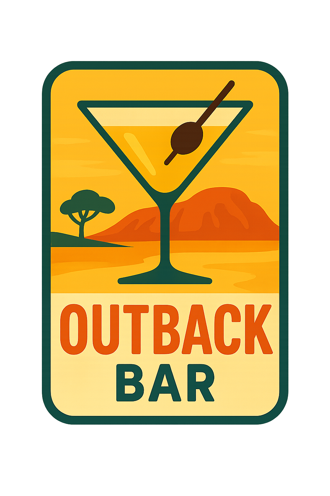

<div align="center">
  
  
  # 🍸 Outback Bar
  
  **AI-Powered Bartender Experience**
  
  [](https://github.com/signalwire/sigmond-outback)
  [](https://signalwire.com)
</div>

---

Welcome to Outback Bar! Powered by SignalWire's AI Agent framework, Max, your virtual bartender at Outback Bar, takes drink orders, manages tabs, and provides personalized service through natural voice conversations.

## 🌟 Features

### Core Functionality
- **Natural Voice Interaction**: Talk to Max like a real bartender
- **Full Drink Menu**: Cocktails, beer, wine, and non-alcoholic options
- **Tab Management**: Real-time tracking of orders and running total
- **Happy Hour**: Automatic 20% discount on cocktails (4-7 PM)
- **Drink Customization**: Order doubles, specify ice preferences, etc.
- **Responsible Service**: Built-in monitoring and service limits
- **Real-time Updates**: Live UI updates as orders are placed

### Menu Categories
- **Cocktails** ($10-13): Margarita, Old Fashioned, Mojito, Martini, and more
- **Beer** ($6-8): IPA, Lager, Stout, Wheat Beer, Pale Ale
- **Wine** ($9-11): House Red/White, Prosecco, Pinot Noir, Sauvignon Blanc
- **Non-Alcoholic** ($0-6): Mocktails, sodas, juices, water

## 🚀 Quick Start

### Prerequisites
- Python 3.8+
- SignalWire account with AI Agent access
- Node.js (for frontend development)

### Installation

1. **Clone the repository**:
```bash
cd bartender
```

2. **Install Python dependencies**:
```bash
pip install -r requirements.txt
```

3. **Configure environment**:
```bash
cp .env.example .env
# Edit .env with your SignalWire credentials
```

4. **Update the SignalWire token**:
Edit `web/app.js` and replace the token:
```javascript
const STATIC_TOKEN = 'your_signalwire_token_here';
```

### Running the Agent

```bash
python bartender_agent.py
```

The server will start on port 3030 by default.

### Access the Web UI

Open your browser to: `http://localhost:3030`

## 🔧 Configuration

### Environment Variables (.env)

```env
# SignalWire Configuration
SIGNALWIRE_PROJECT_ID=your_project_id
SIGNALWIRE_TOKEN=your_token
SIGNALWIRE_SPACE=your_space.signalwire.com

# Server Configuration
HOST=0.0.0.0
PORT=3030

# Bar Settings
HAPPY_HOUR_START=16  # 4 PM
HAPPY_HOUR_END=19    # 7 PM
HAPPY_HOUR_DISCOUNT=0.20  # 20% off

# Service Limits
MAX_DRINKS_PER_HOUR=2
MAX_TOTAL_DRINKS=5
```

## 💬 Usage Examples

### Customer Interactions

**Ordering Drinks**:
- "I'll have a margarita"
- "Can I get a double old fashioned?"
- "What beers do you have on tap?"
- "I'd like something fruity and refreshing"

**Tab Management**:
- "What's my tab?"
- "Can you review my order?"
- "I'm ready to close out"
- "Add a 20% tip"

**Happy Hour**:
- "Is it happy hour?"
- "What's on special?"

## 🏗️ Architecture

### Backend (bartender_agent.py)
- Built on SignalWire's AgentBase class
- Implements SWAIG functions for drink operations
- Uses TF-IDF for fuzzy drink matching (optional)
- Manages conversation flow through state contexts
- Sends real-time events to frontend

### Frontend (web/)
- Single-page application with real-time updates
- WebRTC connection for voice communication
- Responsive design for mobile and desktop
- Visual feedback for all operations
- Bar-themed UI with elegant styling

### Key Components

#### SWAIG Functions
- `add_drink`: Add drinks to customer's tab
- `remove_drink`: Remove items from tab
- `review_tab`: Display current tab status
- `check_happy_hour`: Check happy hour status
- `close_tab`: Process payment and close tab

#### Conversation States
1. **greeting**: Welcome and initial order
2. **taking_order**: Main ordering phase
3. **closing_tab**: Payment processing
4. **tab_closed**: Post-payment state

#### User Events
Events sent from backend to frontend for UI updates:
- `drink_added`: New drink added to tab
- `drink_removed`: Item removed from tab
- `tab_review`: Full tab sync
- `tab_closed`: Payment completed
- `happy_hour_status`: Happy hour status update

## 🎨 Customization

### Adding New Drinks

Edit the `DRINKS` dictionary in `bartender_agent.py`:

```python
"C011": {
    "name": "Espresso Martini",
    "price": 14.00,
    "description": "Vodka, coffee liqueur, espresso",
    "abv": 20,
    "category": "cocktail"
}
```

### Modifying Happy Hour

Adjust times and discount in `.env`:
```env
HAPPY_HOUR_START=15  # 3 PM
HAPPY_HOUR_END=20    # 8 PM
HAPPY_HOUR_DISCOUNT=0.25  # 25% off
```

### Changing the Bartender's Personality

Edit the personality section in `bartender_agent.py`:
```python
self.prompt_add_section(
    "Personality",
    "Your custom personality description here..."
)
```

## 🔊 Audio Feedback

The agent uses audio files for ambient feedback:
- `/pouring.mp3` - When adding drinks
- `/clearing.mp3` - When removing items
- `/calculating.mp3` - When reviewing tab
- `/payment.mp3` - When processing payment

Place these files in your SignalWire assets directory.

## 📊 Responsible Service Features

Built-in safety features include:
- Maximum 5 drinks per customer session
- Maximum 2 drinks per hour monitoring
- Automatic water suggestions after 3 alcoholic drinks
- Service refusal when limits are reached

## 🐛 Troubleshooting

### Connection Issues
- Verify SignalWire credentials in `.env`
- Check token in `web/app.js` is valid
- Ensure port 3030 is not in use
- Check firewall settings

### No Audio
- Allow microphone permissions in browser
- Check SignalWire project has voice enabled
- Verify WebRTC connection established

### Events Not Updating UI
- Check browser console for errors
- Verify user events are being sent (check server logs)
- Ensure WebSocket connection is active

## 📚 API Endpoints

- `GET /` - Main web UI
- `GET /api/menu` - Returns drink menu JSON
- `GET /api/happy-hour` - Current happy hour status
- `GET /api/info` - System information
- `POST /swml` - SignalWire webhook endpoint
- `POST /swml/swaig` - SWAIG function endpoint
- `GET /health` - Health check endpoint

## 🤝 Contributing

Contributions are welcome! Areas for improvement:
- Additional drink recipes
- Payment integration (Stripe/Square)
- Loyalty program features
- Drink recommendation engine
- Multi-language support

## 📝 License

This project is based on the Holy Guacamole architecture and is provided for educational and demonstration purposes.

## 🙏 Acknowledgments

- Built with [SignalWire AI Agents](https://ai.signalwire.com)
- Inspired by the Holy Guacamole implementation
- Uses SignalWire's WebRTC for real-time communication

---

**Need Help?** Check the [SignalWire Documentation](https://developer.signalwire.com) or open an issue.
